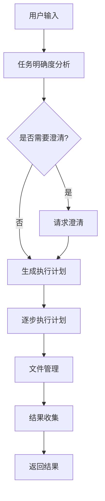

# 数字员工 (Manus) 项目概述与架构

## 📖 项目简介

数字员工 (Manus) 是一个基于大语言模型的智能任务自动化系统，能够理解用户的自然语言需求，自动规划执行方案，并调用各种工具完成复杂任务。该系统采用模块化架构设计，支持多种接口形式，具备强大的扩展性和可维护性。

### 🎯 核心功能

- **智能任务分析**: 使用大语言模型分析用户需求，评估任务明确度
- **自动执行规划**: 根据任务需求自动生成多步骤执行计划
- **工具统一调用**: 通过MCP协议统一管理和调用各种外部工具
- **文件管理**: 自动管理任务过程中产生的文件和结果
- **实时状态反馈**: 提供任务执行过程的实时状态更新
- **多界面支持**: 支持终端和Web两种交互界面

### 🏗️ 系统架构

```
┌─────────────────────────────────────────────────────────────┐
│                      用户交互层                               │
├─────────────────────┬───────────────────────────────────────┤
│   终端聊天界面        │            Web界面                    │
│  (terminal_chat.py) │        (web/frontend/)              │
└─────────────────────┴───────────────────────────────────────┘
                              │
┌─────────────────────────────────────────────────────────────┐
│                      核心业务层                               │
├─────────────────────┬───────────────────┬───────────────────┤
│    任务规划器        │     任务执行器      │    文件管理器       │
│  (TaskPlanner)     │  (TaskExecutor)   │  (FileManager)    │
└─────────────────────┴───────────────────┴───────────────────┘
                              │
┌─────────────────────────────────────────────────────────────┐
│                      工具管理层                               │
├─────────────────────────────────────────────────────────────┤
│                 工具管理器 (ToolManager)                      │
│              统一管理和调用所有外部工具                         │
└─────────────────────────────────────────────────────────────┘
                              │
┌─────────────────────────────────────────────────────────────┐
│                      通信协议层                               │
├─────────────────────────────────────────────────────────────┤
│                  MCP客户端 (MultiMCPClient)                  │
│                基于MCP协议与外部工具通信                        │
└─────────────────────────────────────────────────────────────┘
```

## 🔧 核心组件详解

### 1. 任务规划器 (TaskPlanner)

**位置**: `core/task_planner.py`

**职责**:
- 分析用户输入的明确度和复杂度
- 检测输入是否为对话还是具体任务
- 生成详细的执行计划
- 处理任务改进请求

**核心类**:
- `TaskPlanner`: 主要规划逻辑
- `TaskClarityAnalyzer`: 任务明确度分析器

### 2. 任务执行器 (TaskExecutor)

**位置**: `core/task_executor.py`

**职责**:
- 按计划执行各个步骤
- 处理异常和重试逻辑
- 提供实时状态反馈
- 管理执行结果

**核心功能**:
- 流式执行反馈
- 文件自动注册
- 错误处理和恢复

### 3. 工具管理器 (ToolManager)

**位置**: `tools/tool_manager.py`

**职责**:
- 统一管理所有可用工具
- 验证工具调用合法性
- 提供统一的工具调用接口
- 处理工具调用结果

### 4. 文件管理器 (FileManager)

**位置**: `core/file_manager.py`

**职责**:
- 管理任务产生的文件
- 创建任务目录结构
- 提供文件下载打包功能
- 维护文件元数据

### 5. 事件发射器 (ExecutionEventEmitter)

**位置**: `core/event_emitter.py`

**职责**:
- 提供实时状态更新
- 支持WebSocket推送
- 格式化输出信息
- 事件驱动的状态管理

## 📁 项目目录结构

```
05.数字员工_manus/
├── core/                          # 核心业务逻辑
│   ├── __init__.py               # 模块导出
│   ├── models.py                 # 数据模型定义
│   ├── task_planner.py          # 任务规划器
│   ├── task_executor.py         # 任务执行器
│   ├── file_manager.py          # 文件管理器
│   ├── result_collector.py      # 结果收集器
│   └── event_emitter.py         # 事件系统
│
├── tools/                        # 工具相关
│   ├── __init__.py
│   ├── tool_manager.py          # 工具管理器
│   ├── local_tools.py           # 本地工具
│   └── functions/               # 工具函数实现
│
├── communication/               # 通信相关
│   ├── __init__.py
│   ├── mcp_client.py           # MCP客户端
│   ├── mcp_server.py           # MCP服务器
│   └── mcp_config.json         # MCP配置
│
├── interfaces/                  # 用户接口
│   ├── __init__.py
│   ├── terminal_chat.py        # 终端聊天界面
│   ├── start_terminal_chat.py  # 终端启动脚本
│   └── web/                    # Web界面
│       └── frontend/
│
├── data/                       # 数据存储
│   ├── task_files/            # 任务文件
│   └── execution_results/     # 执行结果
│
├── tests/                      # 测试文件
├── scripts/                    # 脚本文件
├── docs/                       # 文档
├── config/                     # 配置文件
├── main.py                     # 主启动脚本
├── run.py                      # 简化启动脚本
├── requirements.txt            # 依赖包
└── .gitignore                  # Git忽略文件
```

## 🛠️ 技术栈

### 核心依赖
- **Python 3.8+**: 主要编程语言
- **OpenAI**: 大语言模型API
- **Pydantic**: 数据验证和序列化
- **AsyncIO**: 异步编程支持

### 通信协议
- **MCP (Model Context Protocol)**: 与外部工具通信
- **WebSocket**: 实时状态推送
- **HTTP/REST**: Web API接口

### 数据处理
- **Pandas**: 数据分析
- **NumPy**: 数值计算
- **Matplotlib/Plotly**: 图表生成

### 文件处理
- **PyPDF2**: PDF处理
- **python-docx**: Word文档处理
- **openpyxl**: Excel处理
- **Pillow**: 图像处理
- **PyYAML**: YAML配置文件

### Web框架
- **FastAPI**: Web API框架
- **Uvicorn**: ASGI服务器
- **Jinja2**: 模板引擎

### 开发工具
- **Pytest**: 单元测试
- **Loguru**: 日志管理

## 🔄 工作流程

### 典型任务执行流程



### 关键流程说明

1. **任务分析阶段**
   - 使用LLM分析用户输入
   - 评估任务明确度(0-10分)
   - 判断是否为对话还是具体任务

2. **计划生成阶段**
   - 根据可用工具生成执行步骤
   - 验证工具调用的合法性
   - 估算任务复杂度

3. **执行阶段**
   - 按顺序执行各个步骤
   - 实时反馈执行状态
   - 处理异常和错误

4. **结果管理阶段**
   - 收集和整理执行结果
   - 管理生成的文件
   - 创建下载包

## 🚀 扩展性设计

### 工具扩展
- 基于MCP协议，可轻松接入新工具
- 统一的工具调用接口
- 支持工具参数验证

### 界面扩展
- 模块化的界面设计
- 支持多种交互方式
- 事件驱动的状态更新

### 功能扩展
- 插件化的任务处理器
- 可配置的执行策略
- 灵活的文件管理方案

## 📊 系统特性

### 可靠性
- 异常处理和恢复机制
- 任务状态持久化
- 执行过程可追溯

### 性能
- 异步并发处理
- 流式状态反馈
- 优化的文件管理

### 可维护性
- 模块化架构设计
- 清晰的依赖关系
- 完善的日志记录

### 可扩展性
- 基于协议的工具集成
- 插件化的组件设计
- 配置驱动的功能控制 