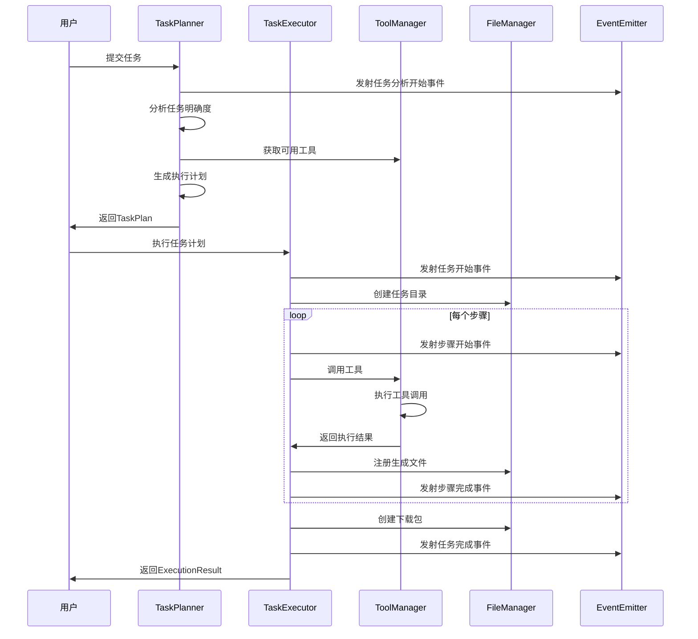
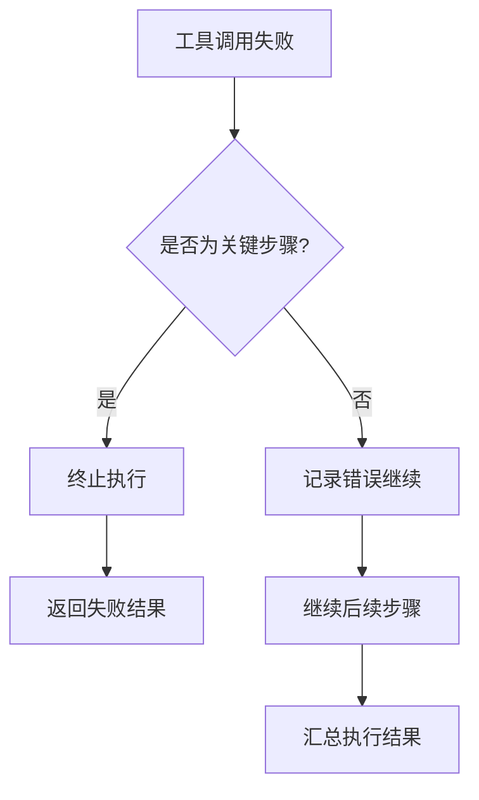

# 数字员工核心模块详解

## 📋 概述

本文档详细介绍数字员工系统的核心模块，包括每个组件的功能、接口、实现细节和使用方法。

## 🧠 任务规划器 (TaskPlanner)

### 核心功能

TaskPlanner是系统的"大脑"，负责分析用户需求并生成可执行的任务计划。

**主要职责**:
1. 任务明确度分析
2. 对话检测和处理
3. 执行计划生成
4. 任务改进处理

### 关键类和方法

#### TaskPlanner 类

```python
class TaskPlanner:
    def __init__(self, llm_client: OpenAI, tool_manager, model_name: str = "Qwen-72B"):
        # 初始化任务规划器
    
    async def analyze_task(self, user_input: str) -> TaskPlan:
        # 分析用户任务，生成执行计划
    
    async def refine_plan_with_feedback(self, task_plan: TaskPlan, user_feedback: str) -> TaskPlan:
        # 根据用户反馈优化计划
```

#### TaskClarityAnalyzer 类

```python
class TaskClarityAnalyzer:
    async def analyze_clarity(self, user_input: str) -> TaskClarityScore:
        # 分析任务明确度，返回0-10分评分
```

### 工作流程

1. **明确度分析**: 
   - 评分标准: 9-10分(非常明确) → 0-2分(非常模糊)
   - 判断是否需要澄清

2. **对话检测**:
   - 区分对话交流和具体任务
   - 对话类型直接回复，任务类型进入规划流程

3. **计划生成**:
   - 基于可用工具生成步骤化方案
   - 验证工具调用合法性
   - 分析任务复杂度

4. **改进处理**:
   - 检测改进请求
   - 基于历史任务生成增量计划

### 配置参数

```python
# 系统提示词配置
PLAN_SYSTEM_PROMPT = """
# 角色：任务解决专家
# 任务：制定详细的步骤化解决方案
# 重要：合理使用文件保存工具，使用中文回答
"""

# 明确度评分标准
CLARITY_THRESHOLDS = {
    "HIGH": 7,      # 7-10分，直接执行
    "MEDIUM": 5,    # 5-6分，可能需澄清
    "LOW": 3        # 0-4分，必须澄清
}
```

## ⚙️ 任务执行器 (TaskExecutor)

### 核心功能

TaskExecutor负责按计划执行各个步骤，提供实时反馈和异常处理。

**主要职责**:
1. 步骤化执行任务计划
2. 实时状态反馈
3. 异常处理和恢复
4. 文件管理集成

### 关键方法

```python
class TaskExecutor:
    async def execute_plan(self, task_plan: TaskPlan, user_id: str = "default") -> ExecutionResult:
        # 执行完整任务计划，返回执行结果
    
    async def execute_step_with_events(self, step: Step) -> Any:
        # 执行单个步骤并发射事件
    
    def _extract_and_register_files(self, task_id: str, result: Any, function_name: str, 
                                   step_id: str, description: str) -> list:
        # 从执行结果中提取和注册文件
```

### 执行流程

1. **预处理**:
   - 创建任务目录
   - 初始化状态追踪
   - 发射任务开始事件

2. **步骤执行**:
   - 逐步执行计划中的每个步骤
   - 实时发射步骤事件
   - 处理步骤间数据传递

3. **文件处理**:
   - 自动提取生成的文件
   - 注册文件到管理系统
   - 创建下载包

4. **结果收集**:
   - 汇总执行结果
   - 计算执行统计
   - 更新任务状态

### 异常处理策略

```python
# 步骤失败处理逻辑
if step.status == StepStatus.FAILED and not step.is_final:
    logger.warning(f"步骤失败，但继续执行后续步骤: {step.error_message}")
elif step.status == StepStatus.FAILED and step.is_final:
    logger.error(f"关键步骤失败，终止执行: {step.error_message}")
    break
```

## 🛠️ 工具管理器 (ToolManager)

### 核心功能

ToolManager提供统一的工具管理和调用接口，基于MCP协议与外部工具通信。

**主要职责**:
1. 统一管理所有可用工具
2. 验证工具调用合法性
3. 提供统一调用接口
4. 处理调用结果

### 关键方法

```python
class ToolManager:
    async def load_all_tools(self) -> None:
        # 从MCP服务器加载所有可用工具
    
    async def call_tool(self, tool_name: str, args: Dict[str, Any]) -> Any:
        # 统一工具调用接口
    
    def validate_tool_call(self, tool_name: str, args: Dict[str, Any]) -> Dict[str, Any]:
        # 验证工具调用的合法性
    
    def get_tools_for_planning(self) -> List[Dict[str, Any]]:
        # 获取用于任务规划的工具信息
```

### 工具集成流程

1. **工具发现**:
   - 从MCP服务器获取工具列表
   - 解析工具描述和参数定义
   - 缓存工具元数据

2. **调用验证**:
   - 检查工具是否存在
   - 验证参数格式
   - 返回验证结果

3. **统一调用**:
   - 通过MCP协议调用工具
   - 处理不同格式的返回值
   - 统一异常处理

4. **结果处理**:
   - 解析JSON格式结果
   - 处理文本格式结果
   - 错误信息标准化

## 📁 文件管理器 (FileManager)

### 核心功能

FileManager负责管理任务执行过程中产生的所有文件，提供完整的文件生命周期管理。

**主要职责**:
1. 任务目录管理
2. 文件注册和追踪
3. 下载包创建
4. 文件元数据管理

### 关键方法

```python
class FileManager:
    def create_task_directory(self, task_id: str, user_id: str = "default") -> Path:
        # 为任务创建专用目录
    
    def register_file(self, task_id: str, file_path: str, file_type: str, 
                     step_id: str, description: str, user_id: str = "default") -> str:
        # 注册文件到管理系统
    
    def create_download_package(self, task_id: str, user_id: str = "default") -> str:
        # 创建任务文件的下载包
    
    def get_task_files(self, task_id: str, user_id: str = "default") -> List[Dict]:
        # 获取任务的所有文件信息
```

### 目录结构

```
data/
├── task_files/{user_id}/{task_id}/
│   ├── step_1_generated_file.py
│   ├── step_2_chart.png
│   └── metadata.json
└── execution_results/
    └── {task_id}_download.zip
```

### 文件注册流程

1. **目录创建**:
   - 基于用户ID和任务ID创建目录
   - 设置适当的权限

2. **文件注册**:
   - 记录文件路径和元数据
   - 生成唯一文件ID
   - 更新任务文件清单

3. **下载包创建**:
   - 收集任务的所有文件
   - 创建ZIP压缩包
   - 生成下载链接

## 📡 事件发射器 (ExecutionEventEmitter)

### 核心功能

ExecutionEventEmitter提供实时的执行状态反馈，支持终端输出和WebSocket推送。

**主要职责**:
1. 实时状态更新
2. WebSocket事件推送
3. 格式化输出信息
4. 事件驱动状态管理

### 关键事件类型

```python
# 任务级别事件
await self.emit_task_analysis_start(user_input)
await self.emit_task_start(task_plan)
await self.emit_task_complete(task_plan, execution_result)

# 步骤级别事件
await self.emit_step_start(step)
await self.emit_step_complete(step, result)

# 工具调用事件
await self.emit_tool_call_start(tool_name, args)
await self.emit_tool_call_complete(tool_name, result, duration)

# 计划生成事件
await self.emit_plan_generation_start(complexity)
await self.emit_plan_step_generated(index, total, description, tool_name)
```

### 输出模式

1. **终端模式**:
   - 彩色文本输出
   - 进度条显示
   - 实时状态更新

2. **WebSocket模式**:
   - JSON格式事件
   - 实时推送到前端
   - 支持多客户端

### 事件格式

```json
{
  "event_type": "step_complete",
  "timestamp": "2024-01-01T12:00:00",
  "data": {
    "step_id": "step_1",
    "step_description": "生成Python程序",
    "result": {...},
    "duration": 2.5
  }
}
```

## 📊 数据模型 (Models)

### 核心数据结构

系统使用Pydantic定义了完整的数据模型，确保类型安全和数据验证。

#### TaskPlan 模型

```python
class TaskPlan(BaseModel):
    task_id: str                    # 任务唯一ID
    user_input: str                 # 用户原始输入
    task_type: str                  # 任务类型
    complexity_level: str           # 复杂度等级(simple/medium/complex)
    plan: Plan                      # 执行计划
    status: TaskStatus              # 任务状态
    requires_clarification: bool    # 是否需要澄清
    clarification_questions: List[str]  # 澄清问题列表
    is_conversation: bool           # 是否为对话
    parent_task_id: Optional[str]   # 父任务ID(用于改进)
    generated_files: List[str]      # 生成的文件列表
```

#### Step 模型

```python
class Step(BaseModel):
    step_id: str                    # 步骤唯一ID
    step_description: str           # 步骤描述
    function_name: str              # 要调用的函数名
    args: Dict[str, Any]           # 函数参数
    is_final: bool                  # 是否为最终步骤
    status: StepStatus              # 步骤状态
    result: Optional[Any]           # 执行结果
    error_message: Optional[str]    # 错误信息
    start_time: Optional[datetime]  # 开始时间
    end_time: Optional[datetime]    # 结束时间
```

#### ExecutionResult 模型

```python
class ExecutionResult(BaseModel):
    task_id: str                    # 任务ID
    success: bool                   # 执行是否成功
    results: List[Dict[str, Any]]   # 步骤执行结果列表
    error_message: Optional[str]    # 错误信息
    execution_time: float           # 总执行时间
    files_generated: List[str]      # 生成的文件列表
```

### 状态枚举

```python
class TaskStatus(Enum):
    PENDING = "pending"         # 等待中
    ANALYZING = "analyzing"     # 分析中
    PLANNING = "planning"       # 计划中
    EXECUTING = "executing"     # 执行中
    COMPLETED = "completed"     # 已完成
    FAILED = "failed"          # 失败
    CANCELLED = "cancelled"     # 已取消

class StepStatus(Enum):
    PENDING = "pending"         # 等待中
    RUNNING = "running"         # 运行中
    COMPLETED = "completed"     # 已完成
    FAILED = "failed"          # 失败
    SKIPPED = "skipped"        # 已跳过
```

## 🔄 模块协作流程

### 典型任务执行流程



### 错误处理流程



## 🛡️ 安全和可靠性

### 输入验证

- 使用Pydantic进行数据验证
- 工具调用参数检查
- 文件路径安全验证

### 异常处理

- 分层异常处理机制
- 详细错误日志记录
- 优雅的错误恢复

### 资源管理

- 自动清理临时文件
- 内存使用监控
- 并发控制机制

## 📈 性能优化

### 异步处理

- 全面使用async/await
- 并发工具调用
- 非阻塞文件操作

### 缓存机制

- 工具元数据缓存
- 任务计划缓存
- 文件信息缓存

### 资源优化

- 懒加载工具列表
- 流式结果处理
- 内存友好的文件管理 